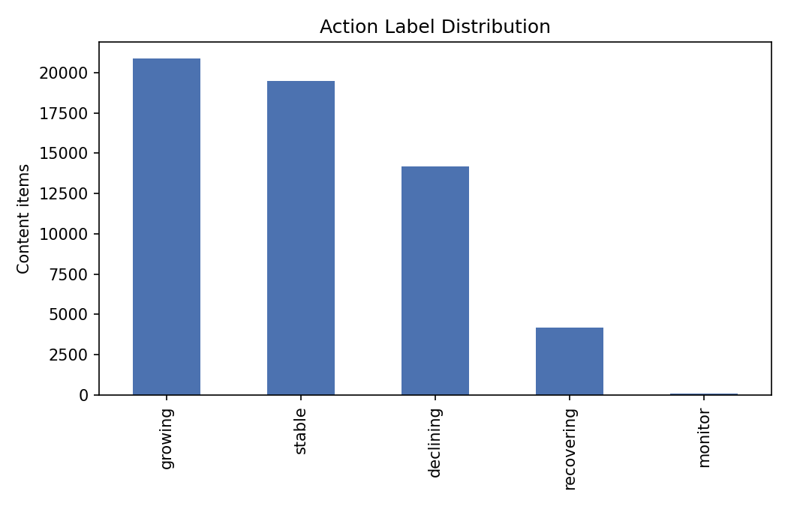
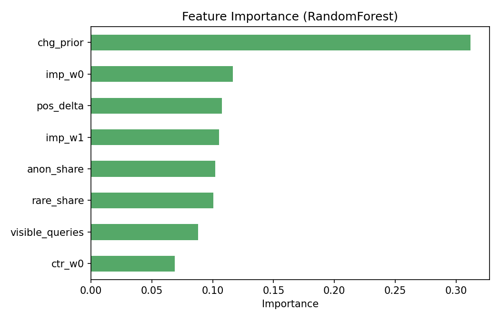

# Refresh & Content Opportunity Scoring: Predicting Content Momentum from Search Performance History

## Abstract
Content teams need to know which pages are about to decline, recover, or keep growing — before it shows up in monthly reports. This work builds a client-grouped classifier that predicts a page's 30-day search momentum using only signals available at decision time. Using ~62,500 content items from the FlyRank warehouse, a RandomForest model trained on trailing-90-day impression, position, and query-mix features reaches 45.4% accuracy against a 30.8% majority-class baseline, with its strongest performance on identifying pages that are recovering from a decline (65.7% precision). The result is a ranked, reason-coded action list — protect, monitor, or rewrite — that content teams can act on directly.

## Introduction / Problem statement
Search performance is reported after the fact. By the time a monthly dashboard shows a page in decline, the decline has already happened. The decision this work supports is: **given what we know about a page today, which action should we take on it — before next month's numbers confirm the trend?** A model that can flag likely decliners and recoverers early lets a content team prioritize review, rewrite, or protection work instead of reacting to stale reports.

## Data
- **Source:** FlyRank Internship — Pseudonymized Warehouse Release (v20260703), accessed via the gated Hugging Face dataset `FlyRank/internship-warehouse`.
- **Tables used:** `fact_content_daily_performance` (78.8M rows, one row per report date × client × content item) for features and labels; `fact_content_query_90d` (2.4M rows) for static query-mix context; `dim_clients` (104 rows) to define the grouped train/test split.
- **Date windows:** features built from the 90 days up to and including a decision date of **2026-02-28**; labels built from the 30 days immediately after that date. The final panel month (June 2026, the `_sample` partition) was held out and never touched.
- **Exclusions:** content items with fewer than 100 impressions in the prior-30-day window were dropped from modeling (too sparse to score reliably) and would be routed to a default "monitor" action in production rather than scored.

## Methodology
**Label definition.** For each content item, momentum was computed as the percent change in impressions from the 30 days before the decision date (`chg_prior`) and the 30 days after (`chg_future`, used only to build the label — never as a feature). Four categories were derived:
- **declining** — future impressions dropped 20%+
- **recovering** — was declining in the prior period but turned up 10%+ after
- **growing** — future impressions rose 20%+
- **stable** — everything else

**Features (all knowable at the decision date):** trailing impressions and clicks, click-through rate, average-position change between the two prior 30-day windows, and query-mix context (visible query count, rare-query share, anonymized-impression share).

**Baseline:** always predict the majority class in the training set (`growing`, 30.8% of the panel).

**Model:** RandomForestClassifier (300 trees, class-balanced), trained and evaluated on a **client-grouped split** (GroupShuffleSplit on `client_hash_id`, 75/25) — so the model is tested on clients it never saw during training, not just held-out rows from familiar sites.

**Leakage check:** as a deliberate test, the label-derived column `chg_future` was added to the feature set. Accuracy jumped to a perfect 1.000 across every class — proof the model was trivially reading the answer. That column was removed and only the honest, leakage-free result below is reported.

## Results
| | Baseline (majority class) | Model (RandomForest, grouped split) |
|---|---|---|
| Accuracy | 30.8% | 45.4% |
| Declining — precision / recall | 0.000 / 0.000 | 0.375 / 0.313 |
| Growing — precision / recall | 0.308 / 1.000 | 0.474 / 0.518 |
| Recovering — precision / recall | 0.000 / 0.000 | 0.657 / 0.422 |
| Stable — precision / recall | 0.000 / 0.000 | 0.456 / 0.512 |

The model beats the baseline on every class, with its clearest edge on **recovering** pages (65.7% precision) — exactly the segment a baseline heuristic can't touch, since it only ever predicts one class.

Feature importance ranked `chg_prior` (pre-decision momentum) as the single strongest signal (0.31), roughly 3x any other feature, followed by trailing impression volume, position change, and query-mix share.

## Limitations & honest framing
- These are **decision-support** signals, not certainties — 45% accuracy on a 4-class problem is a meaningful lift over baseline, not a guarantee for any individual page.
- `fact_content_query_90d` is a single fixed 90-day window over the whole panel, not recomputed per decision date — it's static context, not a true decision-time feature.
- The panel is unbalanced (per-client history depth differs); clients with short history are underrepresented in training.
- Results are validated on one decision date (2026-02-28) against one outcome window; the sealed final month (2026-06) has not yet been used for a true out-of-time check.
- No causal claims are made about *why* pages move — only that these signals are associated with subsequent movement.

## Ranked recommendations
1. **Protect growing and recovering pages first** — these are the highest-precision predictions (65.7% for recovering) and the cheapest wins: don't disturb what's already working.
2. **Route declining-flagged pages to manual review, not automatic rewrite** — 37.5% precision means roughly 3 in 8 flagged pages are true decliners; treat the flag as a prioritized queue, not a verdict.
3. **Treat `chg_prior` as the primary triage signal** — it carries the most predictive weight; a fast dashboard filter on this single feature captures most of the model's value.
4. **Re-run scoring monthly on a rolling decision date** — momentum-based features decay in relevance; a static score goes stale.
5. **Before operational use, validate against the sealed 2026-06 month** to confirm the result isn't specific to the February decision point.

## Reproducibility
Full pipeline (data contract, feature/label construction, grouped-split modeling, leakage demonstration) is in `work/notebooks/capstone_refresh_scoring.ipynb` in this repo, executed end-to-end. Data contract details are in `work/notebooks/w03_data_contract.ipynb`.

## Acknowledgments & data credit
Built on the FlyRank ML Internship dataset — [flyrank.ai](https://flyrank.ai)
